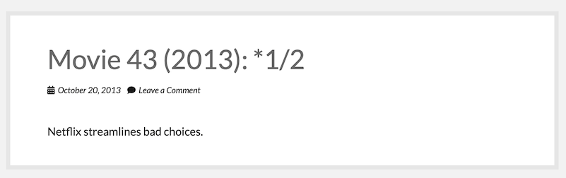
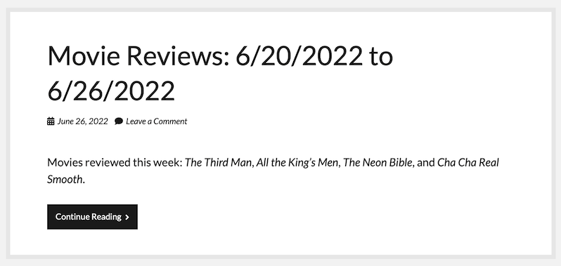
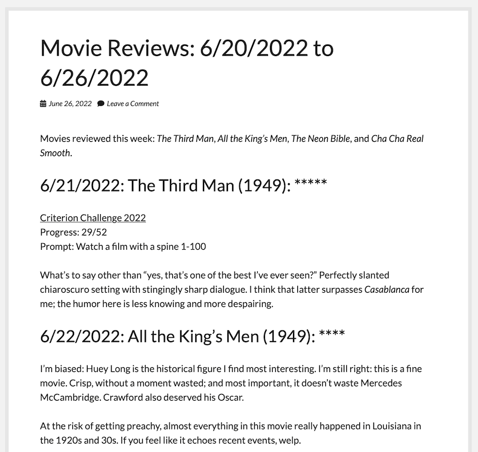

# Introduction

This project was spawned by Elon Musk's Twitter bid, which reminded me
that I want to control my own words as much as possible. While I don't
expect to leave [Letterboxd](https://letterboxd.com/) any time soon and 
I'm happy to pay for their services, I ultimately want to be able to 
display my words on my own server. 

Then things got out of hand and now I have 770 lines of code.

# Installation

## WordPress

Requirements:

- WordPress 6.0+ 
- [BBSpoiler plugin](https://wordpress.org/plugins/bbspoiler/)

You could probably use another spoiler plugin, but might need to edit
this script's code.

This script currently uses [cite] shortcodes for movie titles in the
weekly aggregate review posts, and that shortcode only works on, um, 
my personal WordPress installation. I have opened an issue to fix that.

### Application Password

Head on over to your WordPress [user
panel](https://popone.innocence.com/wp-admin/users.php). Click on your
user name. Scroll down till you find the Application Password section and
create a new one with a name something like "Letterboxd Feed". Make sure
you copy the password when it's displayed; you won't be able to get at it
again and it needs to go in your configuration file.

Disclaimer: this is not optimally secure; at the very least you may want
to go to the trouble of creating a service account user, since you can't
scope the application password to limit permissions. At the very most you
might want to rewrite this script to use OAuth. 

## Local

Requirements:

- python 3.7+
- sqlite

Download this repo however you like.

### Python Packages

This script uses four python packages: requests, BeautifulSoup,
feedparser, and xxhash. You can install these with:

```
python -m pip install -r ./requirements.txt
``` 

### Configuration

Copy `lb_feed.conf.dist` to `lb_feed.conf`. Make the following changes:

`wp_key` should be the application password you generated in the
WordPress installation section of this document.

`wp_url` should be the top level URL of your WordPress blog.

`wp_user` should be the user name associated with the application password.

`post_categories` and `post_tags` are the IDs for the WordPress category
and tag you want for your posts. You can use multiple IDs if you want
more than one category or tag. You can use `show-tags-cats.py` to find
the numeric IDs -- see the Usage section for more.

If you need multiple categories or tags, just provide a comma-separated
list here. Example:

```
post_categories = 10,15
post_tags = 23,90,3
```

If you don't want either categories or tags, you can leave those lines commented
out. Otherwise, remember to uncomment them.

`lb_user` should be your Letterboxd user name.

`db_name` should be the filename of your SQLite database. It defaults to 
`lb_feed.sqlite`.

### SQLite Database

Set up your SQL database as follows:

```
sqlite3 lb_feed.sqlite < lb_feed.sql
```

If you don't want to keep the database in the same directory as the
script, you can put it anywhere; just remember to adjust the
configuration file.

### Initial Data

Unless you're just getting started with Letterboxd or you don't care
about old reviews, you'll want to grab an export of your data so you can
import old reviews to the database. Go to the [Account Data
page](https://letterboxd.com/settings/data/) on your profile and hit
Export Your Data. You'll get a handy ZIP file containing, among other
things, a file called `reviews.csv`. Move that file somewhere handy.

# Usage

## letterboxd-feed-wp.py

Typically, the first time you run this you'll want something like:

```
./letterboxd-feed-wp.py fetchrss
./letterboxd-feed-wp.py fetchcsv --csv ./reviews.csv
./letterboxd-feed-wp.py writeweeks
```

And then on a weekly basis:

```
./letterboxd-feed-wp.py fetchrss
./letterboxd-feed-wp.py writeweeks
```

But there are lots of possibilities. Read on for details.

```
usage: letterboxd-feed-wp.py [-h] [-c CONFIG] [--csv CSV] [--dry-run]
                             [--start-date START_DATE] [--end-date END_DATE]
                             {fetchrss,fetchcsv,write,writeweeks,addspoilers}

positional arguments:
  {fetchrss,fetchcsv,write,writeweeks,addspoilers}
                        Action for the script to take

optional arguments:
  -h, --help            show this help message and exit
  -c CONFIG, --config CONFIG
                        Configuration files (defaults to lb_feed.conf)
  --csv CSV             Letterboxd export file to read from (defaults to
                        reviews.csv)
  --dry-run             Don't write to WordPress or SQLite DB
  --start-date START_DATE
                        Start date for posts in YYYY-MM-DD format (defaults to
                        1970-01-01)
  --end-date END_DATE   End date for posts in YYYY-MM-DD format (defaults to
                        today)
```

You must specify one of five actions:

`fetchrss`: retrieves movie reviews from your Letterboxd RSS feed and
writes them to the database. 

`fetchcsv`: retrieves movie reviews from a Letterboxd CSV export and 
writes them to the database. By default, this option will look for a 
file named `reviews.csv`, but you can specify another file with the
`--csv` option.

`write`: writes movie reviews to your WordPress blog as individual posts.
Don't bother using this option before you've fetched data.



`writeweeks`: writes movie reviews to your WordPress blog aggregated by
weeks. This script defines weeks as Monday through Sunday, with no 
flexibility about that -- sorry! The weekly posts are nicely tucked
away behind a More block.





`addspoilers`: adds a spoiler column to a Letterboxd CSV export. By
default, this option will look for a file named `reviews.csv`, but you
can specify another file with the `--csv` option. It writes to stdout.

The need for this option was superseded by later code but I left it in
here for historical interest and just in case.

There are also some options. We've discussed `--csv`. 

`--config`: allows you to specify a different location for the configuration
file.

`--dry-run`: runs whatever action you've chosen without modifying either the
SQLite database or WordPress. Handy for testing.

`--start-date` and `--end-date`: allows you to specify processing reviews 
posted between specific dates, inclusive (i.e., `--end-date 2021-12-31`
would process reviews posted on the last day of 2021). You can use one and
not the other. If you specify both and the end date is before the start
date, nothing will happen. Sorry, this is not your path to opening a 
dimensional portal to a better world. 

## show-tags-cats.py

This is a quick little helper script I wrote to make it easier to find
the numeric IDs for your WordPress categories and tags. It works as you
might expect:

```
./show-tags-cats.py categories
213: 101 Tasks
65: Computer Games
37: Culture
etc.
```

There's no search functionality; just use `grep` on the output. 

The tag list can take a while to display if you have a lot of tags. I
have 455 tags and it took 13.5 seconds to run through them all.

```
usage: show-tags-cats.py [-h] [-c CONFIG] {categories,tags}

positional arguments:
  {categories,tags}     Specify values to retrieve

optional arguments:
  -h, --help            show this help message and exit
  -c CONFIG, --config CONFIG
```